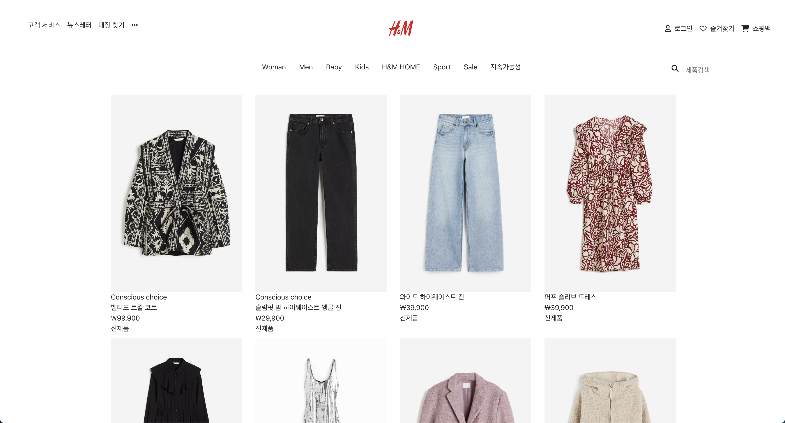
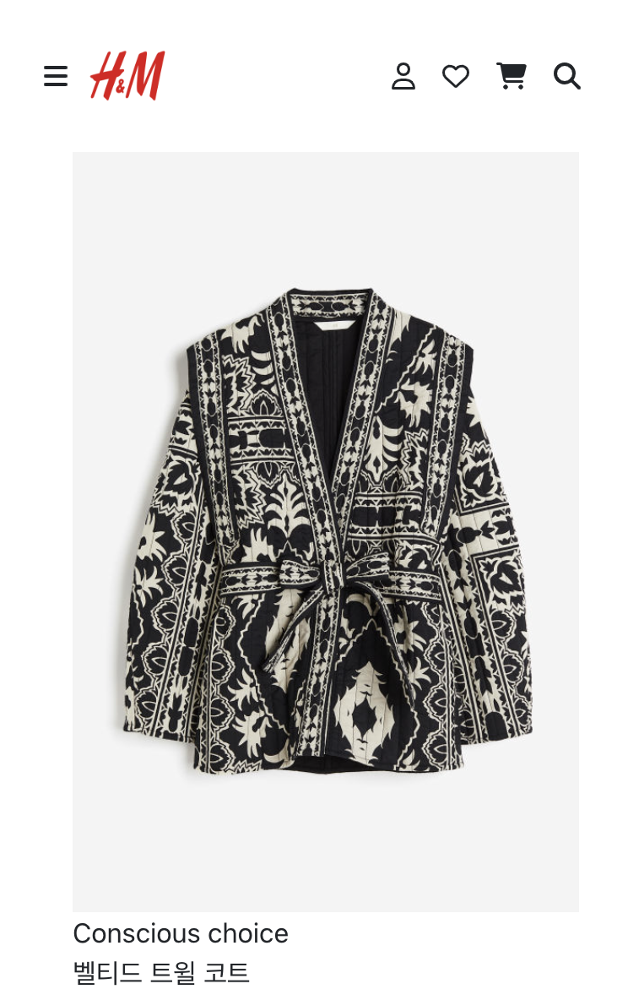

# Simple React Shopping Mall

이 프로젝트는 React를 사용하여 간단한 반응형 쇼핑몰을 만든 프로젝트입니다. 사용자는 제품을 둘러보고, 검색할 수 있으며, 로그인 & 로그아웃이 가능합니다.

## 스크린샷

### Desktop

### Mobile

  

## 기능

- 제품 목록 불러오기
- 제품 검색 기능
- 로그인 및 로그아웃

## 사용 기술

- React
- React Router
- React Bootstrap
- Json Server
- Netlify

## User Story

- 유저는 메뉴와 상품들을 볼 수 있다.
- 유저는 로그인을 할 수 있다.
- 유저는 상품 디테일을 보기 위해 로그인을 해야한다.
- 로그인한 유저는 상품 디테일 정보를 볼 수 있다.
- 유저는 상품을 검색할 수 있다.
- 유저는 로그아웃 할 수 있다.

## 배포

이 프로젝트는 Netlify를 통해 배포되었습니다. 아래 링크를 클릭하여 확인해주세요.

- <https://react-shoppingmall-hnm.netlify.app>
